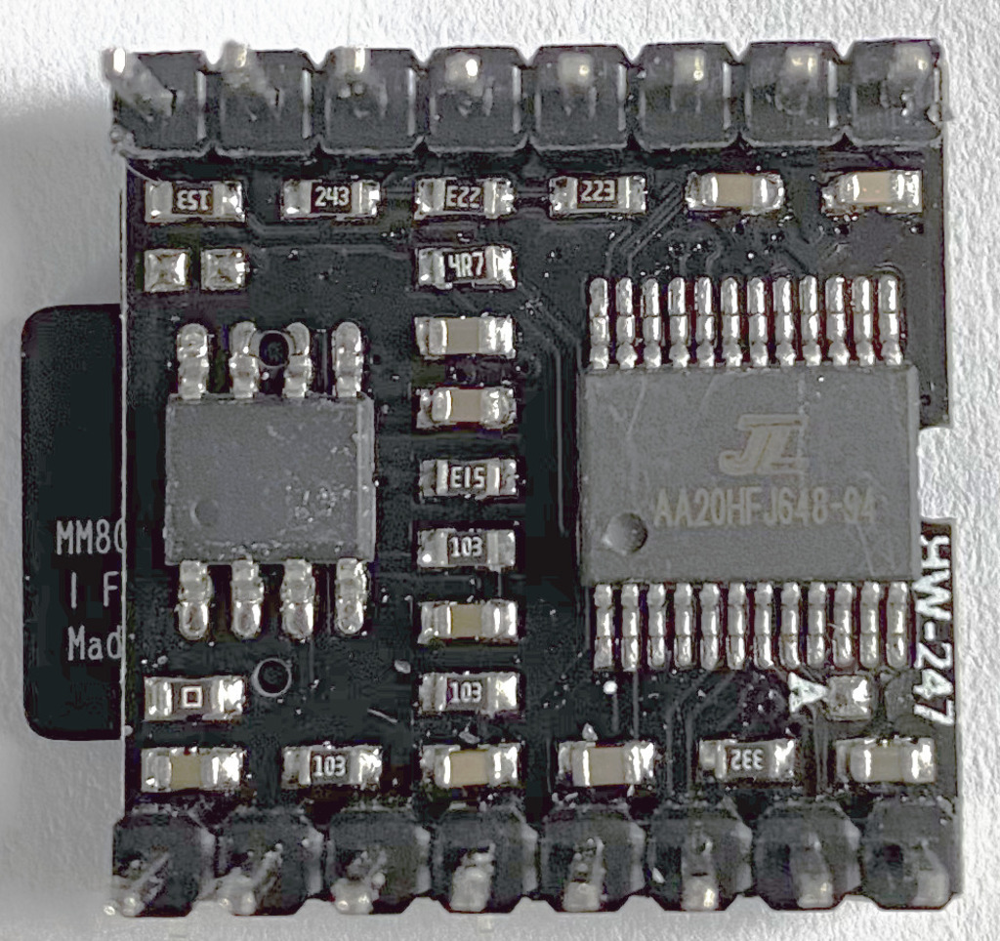

# Carl music box

[](https://github.com/jandelgado/carl/actions/workflows/build.yml)

This is the firmware repository for the Carl music box. Details will follow
shortly.


<!-- vim-markdown-toc GFM -->

* [Hardware](#hardware)
    * [DFPlayerMini Modules](#dfplayermini-modules)
* [Build the firmware](#build-the-firmware)
    * [Configuration](#configuration)
    * [Arduino IDE](#arduino-ide)
    * [PlatformIO](#platformio)
* [References](#references)
* [Author](#author)

<!-- vim-markdown-toc -->

## Hardware

TODO

### DFPlayerMini Modules

During the tests of Carl, we encountered different DFPlayerMini modules, which
turned out to behave differently. DFPlayer's with the GD3200B chip for example
were found **not** to work with any of the available libraries.

The differences can easily be spotted and are described below.

| Working                                         | Not Working                                                             |
|---------------------------------------------------------|---------------------------------------------------------------------------------|
| 24 pins, labelled `AA20HFJ648-94`                       | 16 pins, labelled `GD3200B`                                                     |
|  |  |

The DFPlayerMini with the `GD3200B` failed reporting correctly the number of
songs per folder.

There are more models out there, see [this site for a testing tool and further
information](https://github.com/ghmartin77/DFPlayerAnalyzer)

## Build the firmware

The firmware can be built using the Arduino IDE or PlatformIO.

### Configuration

The firmware image can be configured either in [config.h](carl/config.h) (for Arduino IDE) or

in [platform.ini](carl/platform.ini). The following options can be configured:

| Option                    | `#define`                    | Default                             |
|---------------------------|------------------------------|-------------------------------------|
| Disable logging           | `NO_LOGGING`                 | unset, i.e. logging is enabled      |
| Enable configuration mode | `ENABLE_CONFIG_MODE`         | unset, i.e. config mode is disabled |
| Support large folders     | `USE_LARGE_FOLDERS`          | disabled                            |
| Use PowerBroker's driver  | `USE_POWERBROKER_MP3_DRIVER` | this is the default                 |
| Use Makunas's driver      | `USE_MAKUNA_MP3_DRIVER`      |                                     |
| Use DFRobot's driver      | `USE_DFROBOT_MP3_DRIVER`     |                                     |
 
Choose one of the `USE_*_MP3_DRIVER` options. If not set, the PowerBroker
driver will be used. When the firmware is build using platformio (i.e. using
`make`) the required libraries are downloaded automatically.  When using the
Arduino IDE, don't forget to install the actual libraries:
* [DFPlayerMini_Fast](https://github.com/PowerBroker2/DFPlayerMini_Fast) and [FireTimer](https://github.com/PowerBroker2/FireTimer) for `USE_POWEBROKER_MP3_DRIVER`
* [DFMiniMp3](https://github.com/Makuna/DFMiniMp3) for `USE_MAKUNA_MP3_DRIVER`
* [DFRobotPlayerMini](https://github.com/DFRobot/DFRobotDFPlayerMini) for `USE_DFROBOT_MP3_DRIVER` 

### Arduino IDE

Check out the repository on your computer. In the Arduino IDE select `Open ...`
under the `File` menu and select the file `carl/carl.ino`.

Select `Arduino Pro or Pro Mini` as the target board under `Tools` > `Board` >
`Arduino AVR Boards`. The processor used is an `Atmega328P 5V 16MHz`.

Install the needed libraries using `Sketch` > `Include Library` > `Manage Libraries...`:
* AnalogMultiButton (1.0.0)
* DFPlayerMini_Fast (1.2.4)
* JLed (4.7.0)
* log4arduino (1.0.0)

Alternatively, install the libraries with this command:
```
arduino --install-library JLed:4.7.0,log4arduino:1.0.0,AnalogMultiButton:1.0.0,DFPlayerMini_Fast:1.2.4,FireTimer:1.0.5
```

Compile and upload the sketch using the corresponding commands in the Arduino
IDE.

### PlatformIO

Check out the repository on your computer. Then `cd carl/carl` and run one of

* `make upload-dfrobot && make monitor`
* `make upload-makuna && make monitor`
* `make upload-powerbroker && make monitor`

to build and upload the firmware and to start the serial monitor. The different
commands correspond to the different drivers for the DFPlayerMini module that
can be used: `DFRobot`, `Makuna` and `PowerBroker2`. Test the different drivers
in case you have problems getting your module running. When building with
the Arduino IDE, the PowerBroker2 driver is used by default.

## References

* [Carl testdata generator](https://github.com/jandelgado/carl-testdata/)
* [DFRobot DFRobotDFPlayerMini Library](https://github.com/DFRobot/DFRobotDFPlayerMini)
* [Makuna DFMiniMp3 Library](https://github.com/Makuna/DFMiniMp3)
* [Powerbroker2 DFPlayerMini_Fast Library](https://github.com/PowerBroker2/DFPlayerMini_Fast)
* [JLed](https://github.com/jandelgado/jled)
* [log4arduino](https://github.com/jandelgado/log4arduino)
* [DFPlayer Analyzer](https://github.com/ghmartin77/DFPlayerAnalyzer)

## Author

(C) Copyright 2021 by Jan Delgado.
