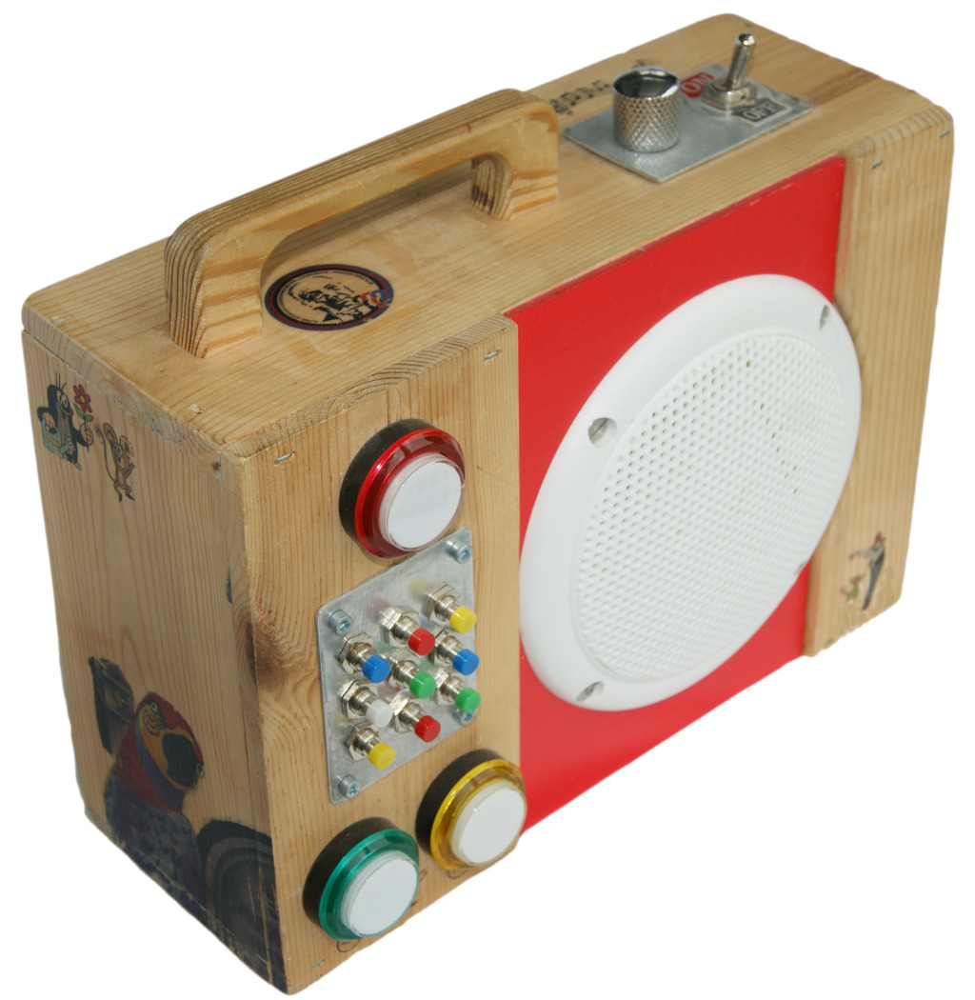
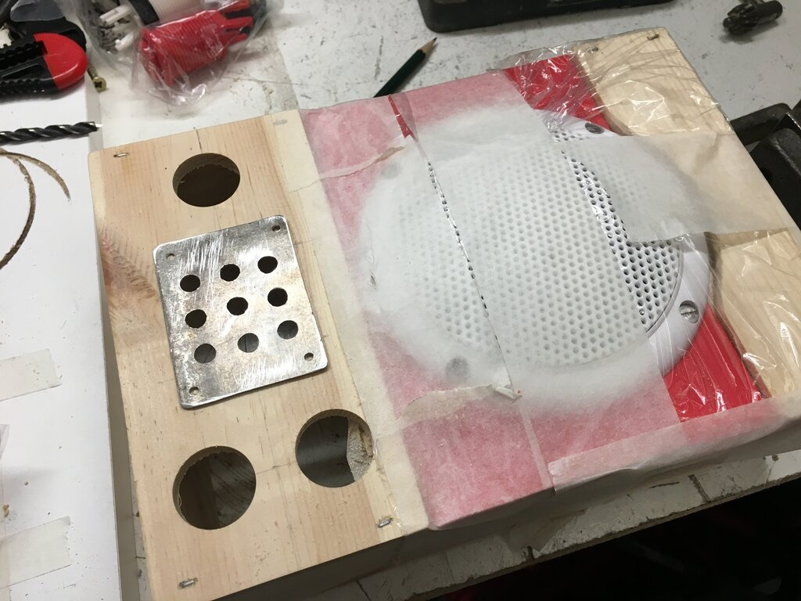

# Carl music box

[](https://github.com/jandelgado/carl/actions/workflows/build.yml)

Carl is an MP3 player for kids. This repository hosts the firmware
and build instructions.

Carl was featured in the German edition of the Make Magazine in August 2021:

<p float="left">
  
  
</p>

<!-- vim-markdown-toc GFM -->

* [Hardware](#hardware)
    * [Bill of Material](#bill-of-material)
    * [Notes on the assembly](#notes-on-the-assembly)
    * [Circuit](#circuit)
        * [Buttons](#buttons)
            * [Calibration](#calibration)
        * [MP3 player module](#mp3-player-module)
            * [Note on DFPlayer Mini Modules](#note-on-dfplayer-mini-modules)
        * [Amplification and volume control](#amplification-and-volume-control)
        * [Status LED](#status-led)
        * [Power supply](#power-supply)
        * [Wiring details](#wiring-details)
    * [Construction of the case](#construction-of-the-case)
    * [Artwork](#artwork)
* [Build the firmware](#build-the-firmware)
    * [Configuration](#configuration)
        * [DFPlayer driver library selection](#dfplayer-driver-library-selection)
        * [GD3200B Quirks mode](#gd3200b-quirks-mode)
    * [Arduino IDE](#arduino-ide)
    * [PlatformIO](#platformio)
    * [Connecting the USB-to-Serial adapter](#connecting-the-usb-to-serial-adapter)
* [References](#references)
* [Author](#author)

<!-- vim-markdown-toc -->

## Hardware

### Bill of Material

  * wooden box for the case
  * 1 [Arduino Pro Mini](https://www.arduino.cc/en/pmwiki.php?n=Main/ArduinoBoardProMini)
  * 1 [DFPlayer Mini MP3 Module](https://wiki.dfrobot.com/DFPlayer_Mini_SKU_DFR0299)
  * 1 full range speaker (4 Ohms, 10W, 10cm diameter)
  * 1 USB Power bank (1 cell including charging and DC-DC converter)
  * 3 arcade buttons
  * 9 momentary buttons
  * 1 potentiometer
  * 1 power switch
  * 1 LED + Resistor (220 Ohms)
  * Resistors (1x500, 11x100, 1x1K) Ohms
  * cables, screws, glue, metal plates

### Notes on the assembly

I recommend to first build and test the electronics, and if it's running, to 
build the case and assemble everything. The electronics can be built and tested
step-by-step:

* Connect DFPlayer Mini to the Arduino
* Connect the speaker to the DFPlayer
* Connect the status-LED
* Connect the volume control potentiometer
* Flash the firmware
* Connect the power bank
* First test with the *virtual keyboard* and a testing SD-Card (see links)
* Assemble and connect the keypad
* Test and calibration of the keypad
* Final test with a self-prepared SD-Card

The first test is best done with Carl's *virtual keyboad* feature, which does
not require the physical keypad. Carl is remote-controlled via the serial port
per with simple key presses. For that to work, connect Carl using the serial
console of the Arduino IDE with 9600 Baud. The keys `1` to `9` select a
playlist, `p` is the play/pause/stop button and `+` and `-` skip songs forward
or backward. Download a pre-populated SD-Card image from the [carl-testdata
repository](https://github.com/jandelgado/carl-testdata) to start immediately.


### Circuit


#### Buttons

The 12 buttons are connected by a resistor network using only a single wire and
an analog input of the Arduino. In contrast to a traditional wiring, where every
button is connected individually (12 inputs needed), or using a matrix (3+4
inputs needed), this drastically simplifies wiring and resource usage on the
micro controller. 

The principle is as follows: if no button is pressed, the circuit is grounded and
no current flows. If a button is pressed, the circuit will become a voltage
divider. Depending on which button is pressed, a different voltage is connected
to the A2 analog GPIO of the Arduino. Carl uses the [AnalogMultiButton Library](
https://github.com/dxinteractive/AnalogMultiButton) to determine which button
was pressed (by measuring the voltage):

<p float="left">
   
   
   
</p>

##### Calibration

The *AnalogMultiButton* Library used must me calibrated with the expected
voltages. This is because we use a network of resistors, which have tolerances.
The calibration is done by connecting the keypad to the Arduino and running a simple
calibration sketch, which measures the voltage for each key-press:

```c++
constexpr auto PIN_BUTTONS = A2;

void setup() {
    pinMode(PIN_BUTTONS, INPUT);
    Serial.begin(9600);
}

void loop(){
    Serial.println(analogRead(PIN_BUTTONS));
    delay(50);
}
```

The sketch must be compiled in the Arduino IDE. Afterwards upload it to the 
Arduino and open the serial monitor of the Arduino IDE. Press the buttons in
the order of connection, starting with the `PREV SONG` button, and write 
down the resulting values (voltages). These values must then be configured in the
`button_values_[]` array of the [keypad.h](carl/keypad.h) source file, like e.g.:

```c++
// excerpt from keypad.h
static constexpr int button_values_[] = {
      ...
      // add your measured 12 values here
      323, 344, 369, 398, 431, 470,
      517, 574, 645, 736, 857, 1023
};
```

In the example the butons were pressed in the order of connection and the 
values `323`, `344`, `369` etc. were determined using the calibration script.

#### MP3 player module

The main components used are an Arduino Pro Mini and the DFPlayer Mini MP3
module. The latter is controlled through a serial connection to the Arduino
using a simple protocol. We use a software serial implementation so we can
still use the builtin serial interface of the Arduino for flashing and to
monitor logging output. The DFPlayer Mini module provides a `busy` signal,
which is fed back into the Arduino to monitor, when playback in the module is
active.


(See my Arduino page [for an evaluation of different MP3 modules](https://github.com/jandelgado/arduino/blob/b1bb1a1546428236d478bec674c78952836e2a1d/README.md))

##### Note on DFPlayer Mini Modules

During the tests of Carl, we encountered different DFPlayer Mini modules, which
turned out to behave differently. DFPlayer's with the `GD3200B` chip for example
were found ~~**not** to work with any of the available libraries~~ to only work
in a quirks mode.

The differences can easily be spotted and are described below.

| Working                                                 | ~~Not Working~~ Working with Quirks                    |
|---------------------------------------------------------|--------------------------------------------------------|
| 24 pins, labeled `AA20HFJ648-94`                       | 16 pins, labeled `GD3200B`                            |
|  |  |

The DFPlayerMini with the `GD3200B` failed reporting correctly the number of
songs per folder. A Quirks mode is provided, to get these modules work with
Carl.

Besides the mentioned `GD3200B` model, there are more models out there which
may be incompatible, see [this site for a testing tool and further
information](https://github.com/ghmartin77/DFPlayerAnalyzer).

#### Amplification and volume control

For amplification, the built-in speaker amplifier (3W) of the DFPlayer Mini is
used. This works very well even with a larger speaker as used in this project. The
volume is controlled indirectly by a potentiometer which output is connected to
an analog input of the Arduino. The value of the potentiometer is used to
control the output volume of the DFPlayer Mini by sending a volume control
command to the DFPlayer Mini.

#### Status LED

The status LED is built into the play/pause button. It is used to give visual
feedback during operation. In future versions, we could add more LEDs to
provide some effects or more feedback. But be aware that a single LED draws
about 20mA, which contributes significantly to the total power consumption of
the player (about 90mA in operation). The LED is controlled by the
[JLed](https://github.com/jandelgado/jled) library, which evolved as a
side-project during development of Carl.

#### Power supply

A USB power bank is used as the power supply. Since these devices use a DC-DC
step up converter (aka boost-converter), this is more efficient then using a
higher rated power source (e.g. 9V battery) and stepping the voltage down using
the Arduino's built-in power regulator. Using a power bank also allows to easily
charge Carl with an off-the-shelf USB charger.


#### Wiring details

Inner view of Carl and the stripboard with the Arduino and DFPlayer Mini with
the USB-to-Serial adapter used for flashing the Arduino connected.

<p float="left">
    
    
    
</p>

### Construction of the case

While the electronics are straight forward, the case was by far the most time
consuming part of the project (at least for me...). It was built of an old box
I had left over from a packaging of two bottles of wine. At first I shorted
the box little, then I finished the wood with sandpaper. Next the drillings for
the 3 big buttons and the opening for the speaker were made. The holes for the
big arcade buttons were drilled using an 1-inch forstner drill.

<p float="left">
  
  
  
</p>

Details of the key panel for the playlist selection with 9 momentary buttons:

<p float="left">
    
    
    
    
</p>

Details of the back cover plate, which is mounted with 2 screws that can be 
removed easily without any tools:

<p float="left">
    
    
</p>

### Artwork

The artwork was applied to the case using the so called *acrylic transfer
method*.  Basically it works as follows:
  * laser print your artwork. The method will not work with ink printed
    material. Note, that during transfer, the image will be mirror-inverted
  * apply the acrylic medium to the wood, and put the printout with the printed
    side on it and carefully press it on the acrylic medium
  * wait until it the acrylic medium is dry (24 hours)
  * with a sponge and water, carefully rub of the paper
  * the toner is is now permanently transferred to the acrylic medium
  * for fixation, apply a layer of wood glue or acrylic medium on the
    transferred image

<p float="left">
  
  
  
</p>

## Build the firmware

The firmware can be built using the Arduino IDE or PlatformIO.

### Configuration

The firmware image can be configured either in [config.h](carl/config.h) (for Arduino IDE) or
in [platform.ini](carl/platform.ini). The following options can be configured:

| Option                     | `#define`                    | Default                             |
|----------------------------|------------------------------|-------------------------------------|
| Disable logging            | `NO_LOGGING`                 | unset, i.e. logging is enabled      |
| Enable configuration mode  | `ENABLE_CONFIG_MODE`         | unset, i.e. config mode is disabled |
| Support large folders      | `USE_LARGE_FOLDERS`          | disabled                            |
| Use PowerBroker's driver   | `USE_POWERBROKER_MP3_DRIVER` | this is the default                 |
| Use Makunas's driver       | `USE_MAKUNA_MP3_DRIVER`      |                                     |
| Use DFRobot's driver       | `USE_DFROBOT_MP3_DRIVER`     |                                     |
| Enable GD3200B Quirks Mode | `GD3200B_QUIRKS`             | unset                               |

#### DFPlayer driver library selection

Choose one of the `USE_*_MP3_DRIVER` options. If not set, the PowerBroker
driver will be used. When the firmware is build using platformio (i.e. using
`make`) the required libraries are downloaded automatically.  When using the
Arduino IDE, don't forget to install the actual library used, e.g.:
* [DFPlayerMini_Fast](https://github.com/PowerBroker2/DFPlayerMini_Fast) and [FireTimer](https://github.com/PowerBroker2/FireTimer) for `USE_POWEBROKER_MP3_DRIVER`
* [DFMiniMp3](https://github.com/Makuna/DFMiniMp3) for `USE_MAKUNA_MP3_DRIVER` (recommended for GD3200B models)
* [DFRobotPlayerMini](https://github.com/DFRobot/DFRobotDFPlayerMini) for `USE_DFROBOT_MP3_DRIVER`

#### GD3200B Quirks mode

When using `GD3200B` based DFPlayer modules, the `GD3200B_QUIRKS` `#define` has
to be set in order to circumvent some incompatibilities (bugs?) these devices
have.  I successfully tested a `GD3200B` DFPlayer using the Makuna-Driver
(`USE_MAKUNA_MP3_DRIVER`) and the quirks mode enabled. Check the log output
to make sure that the `GD3200B` quirks mode is enabled on startup:

```
0(1412): carl starting.
0(1379): using Makuna driver
61(1321): m scanning folders...
62(1319): m enabling GD3200B quirks mode
```

### Arduino IDE

Check out the repository on your computer. In the Arduino IDE select `Open ...`
under the `File` menu and select the file `carl/carl.ino`.

Select `Arduino Pro or Pro Mini` as the target board under `Tools` > `Board` >
`Arduino AVR Boards`. The processor used is an `Atmega328P 5V 16MHz`.

Install the needed libraries using `Sketch` > `Include Library` > `Manage Libraries...`:
* AnalogMultiButton (1.0.0)
* DFPlayerMini_Fast (1.2.4) (Powerbroker DFPlayer Library)
* JLed (4.9.0)
* log4arduino (1.1.0)

Alternatively, install the libraries with this command:
```
arduino --install-library JLed:4.9.0,log4arduino:1.1.0,AnalogMultiButton:1.0.0,DFPlayerMini_Fast:1.2.4,FireTimer:1.0.5
```

Compile and upload the sketch using the corresponding commands in the Arduino
IDE.

### PlatformIO

Check out the repository on your computer. Then `cd carl/carl` and run one of

* `make upload-dfrobot && make monitor`
* `make upload-makuna && make monitor`
* `make upload-powerbroker && make monitor`

to build and upload the firmware and to start the serial monitor. The different
commands correspond to the different drivers for the DFPlayerMini module that
can be used: `DFRobot`, `Makuna` and `PowerBroker2`. Test the different drivers
in case you have problems getting your module running. When building with
the Arduino IDE, the PowerBroker2 driver is used by default.

### Connecting the USB-to-Serial adapter

Since the Arduino Pro Mini has no USB port, we need to connect an USB-to-Serial
adapter to flash the Arduino:


## References

* [DFRobot DFPlayer Mini]()
* [Carl testdata generator](https://github.com/jandelgado/carl-testdata/)
* [DFRobot DFRobotDFPlayerMini Library](https://github.com/DFRobot/DFRobotDFPlayerMini)
* [Makuna DFMiniMp3 Library](https://github.com/Makuna/DFMiniMp3)
* [Powerbroker2 DFPlayerMini_Fast Library](https://github.com/PowerBroker2/DFPlayerMini_Fast)
* [JLed](https://github.com/jandelgado/jled)
* [log4arduino](https://github.com/jandelgado/log4arduino)
* [DFPlayer Analyzer](https://github.com/ghmartin77/DFPlayerAnalyzer)
* [GD3200 information](https://discourse.voss.earth/t/dfplayer-verschiedene-versionen/681/178)

## Author

(C) Copyright 2021-2022 by Jan Delgado.

